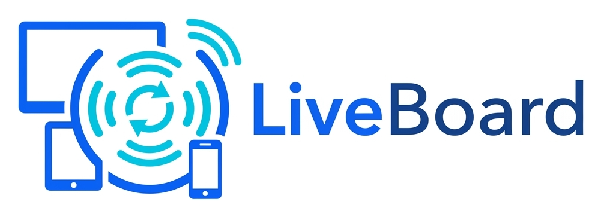
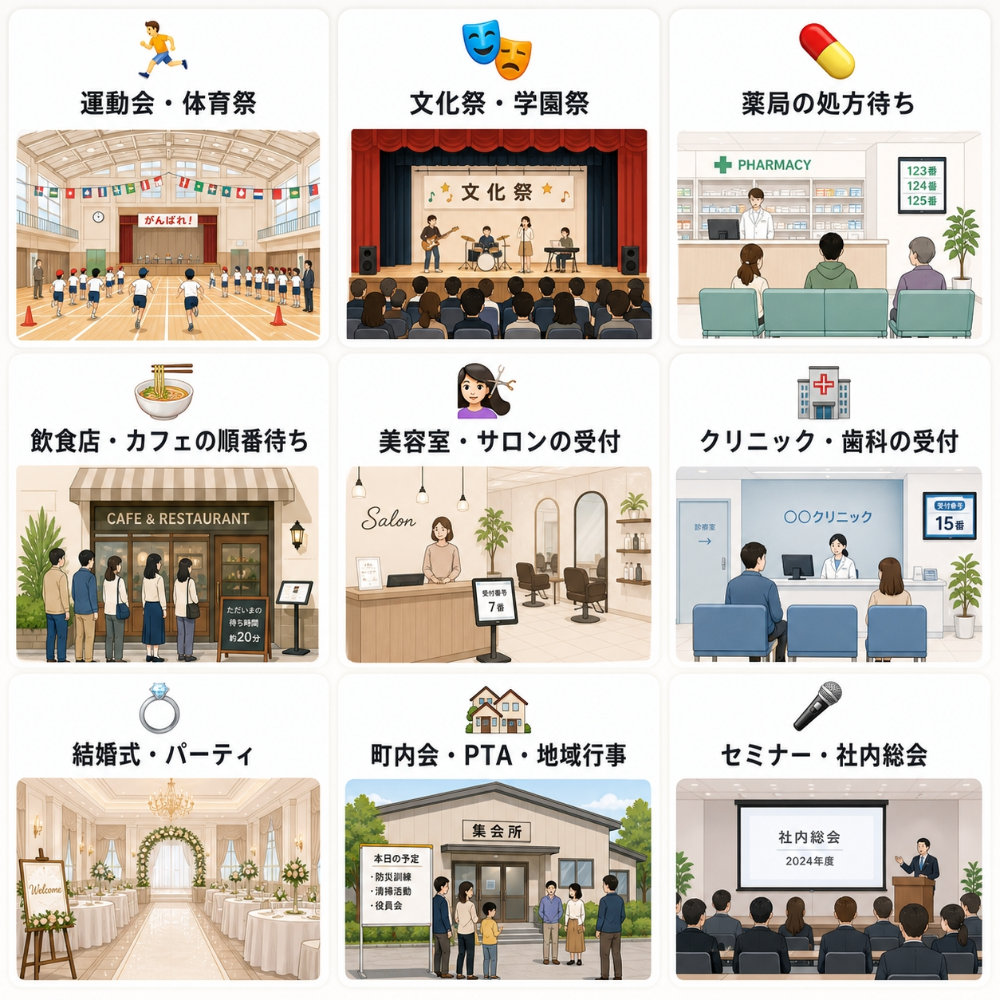
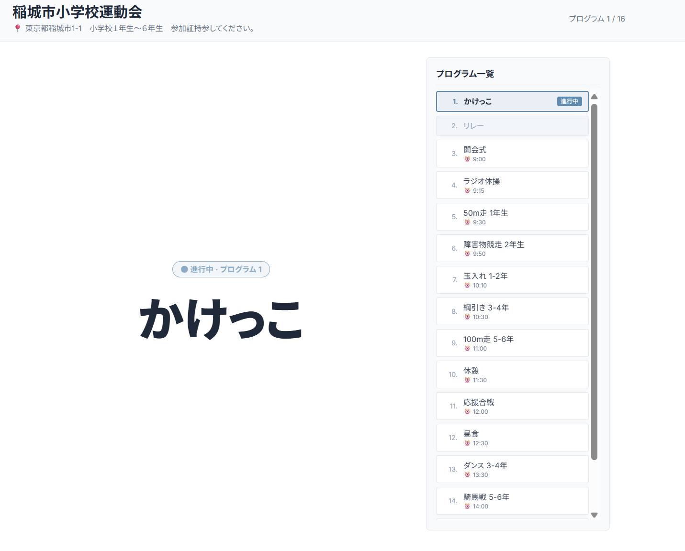
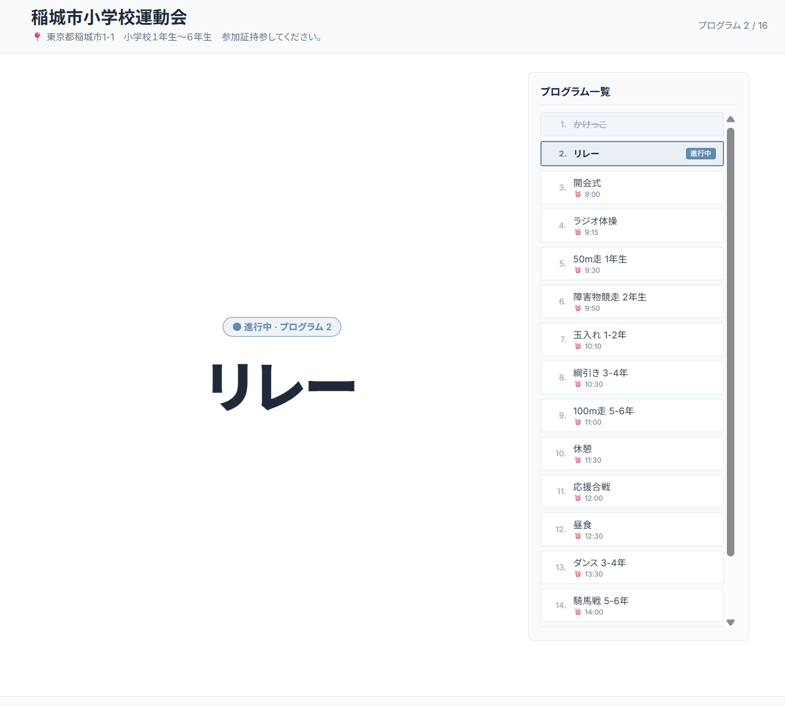
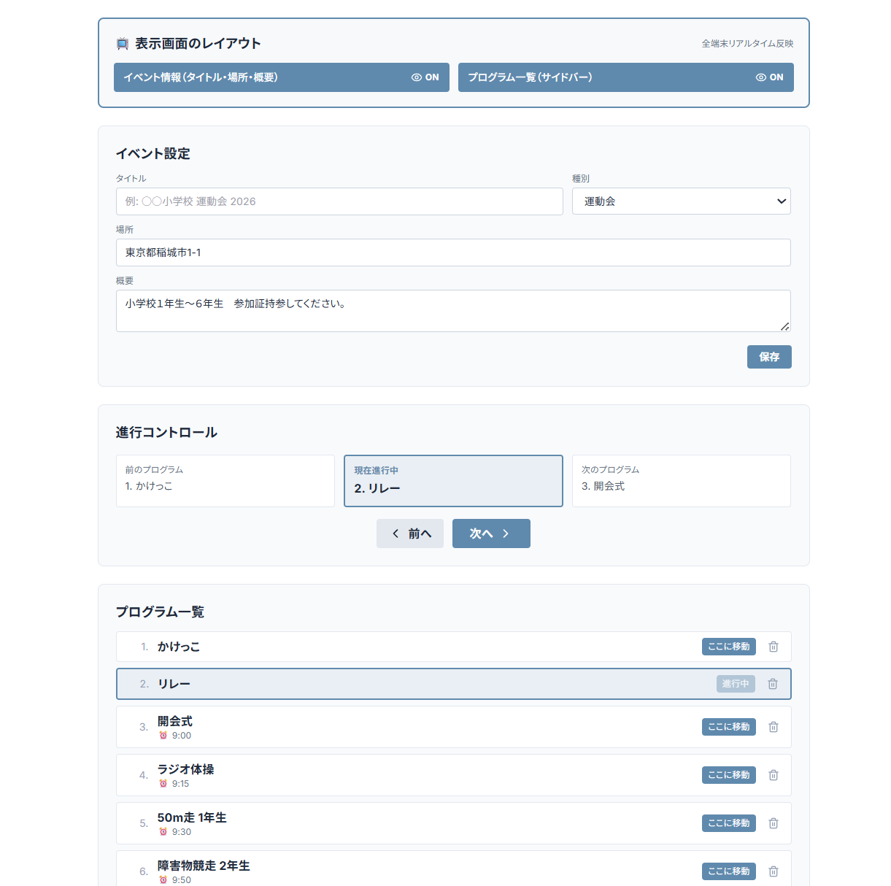

<p align="center">
  
</p>

# live-board

「いま何番／何が進行中か」を全端末リアルタイム同期で大画面表示するアプリ。

会場の大型スクリーン・受付モニタ・来場者のスマホが、全員同じ画面を見られる。

公開URL: **https://tsubasagit.github.io/live-board/**

## 紹介動画

▶️ **[LiveBoard 紹介動画を見る（54秒・mp4）](https://tsubasagit.github.io/live-board/videos/liveboard-intro.mp4)**

※ イメージです。動画は生成AIで作成したもので、実際の表示画面のようにするにはカスタマイズが必要です。

## 使える場面

<p align="center">
  
</p>

- 🏃 運動会・体育祭・文化祭（保護者・別教室にスマホで進行共有）
- 💊 薬局の処方待ち（「ただいま◯番」を待合とスマホに同時表示）
- 🍜 飲食店・カフェの順番待ち（QRで「あと何組」が見える）
- 💇 美容室・歯科クリニックの呼び出し
- 💍 結婚式・パーティの進行表（司会・親族・ゲスト共有）
- 🏘 町内会・PTA・お祭りのステージ進行
- 🎤 セミナー・社内総会のアジェンダ進捗

## スクリーンショット

### 表示画面（来場者向け・大画面）
タイトル/場所/概要をヘッダーに、現在進行中のプログラムを中央に大きく表示。右側にプログラム一覧（現在地ハイライト・完了は打消し線）。運営者が「次へ」を押した瞬間、全端末で同時に切り替わる。





### 操作画面（運営者向け）
上段の「表示画面のレイアウト」で大画面側の見せ方をリアルタイム制御（イベント情報・プログラム一覧の表示/非表示）。下にイベント設定、進行コントロール（前へ/次へ）、プログラム一覧、CSV一括登録、危険な操作（イベント削除）まで1画面に集約。



## Tech Stack

- React + Vite + TypeScript
- Tailwind CSS
- Zustand
- Firebase Firestore
- GitHub Pages

## 構成

| 画面 | パス | 対象 |
|---|---|---|
| ホーム | `/` | 全員（QR・リンク表示） |
| 操作画面 | `/#/control` | 運営者（PIN認証） |
| 表示画面 | `/#/display` | 視聴者（フルスクリーン） |

## 開発

```bash
npm install
npm run dev    # http://localhost:5173
npm run build  # 本番ビルド
```

## ドキュメント

- 仕様: [SERVICE_SPEC.md](./SERVICE_SPEC.md)
- 技術メモ: [CLAUDE.md](./CLAUDE.md)
- Firebase セットアップ: [docs/FIREBASE_SETUP.md](./docs/FIREBASE_SETUP.md)
- セキュリティ方針 + コミット前チェックリスト: [SECURITY.md](./SECURITY.md)

## カスタマイズ開発・受託

LiveBoard は **標準UI（運動会向け進行表示）のまま無料**で利用可能です（MITライセンス）。
番号呼び出し・順番待ち表示・業種特化レイアウトなど **個別カスタマイズ開発を順次受付中**です。

### 料金目安

| プラン | 料金 | 内容 | 納期 |
|---|---|---|---|
| ライト | ¥30,000〜 | ロゴ／カラー／文言の差し替え、業種に合わせた絵文字・項目調整 | 3〜5営業日 |
| **スタンダード（人気）** | **¥100,000〜** | 番号呼び出し画面、順番待ちカウンター、待ち時間予測など業種別UIの新規開発 | 2〜3週間 |
| フル | ¥500,000〜 | 独自ドメイン運用、複数拠点同期、QR発券・予約システム連携、外部API連携 | 1〜2ヶ月 |

※ 上記は目安です。ヒアリング後、無料お見積もりを発行します。
※ Firebase 無料枠で運用可能な範囲なら **月額ランニング ¥0** を維持できます。

### 既存の順番待ち管理サービスとの3年総額比較

| サービス形態 | 初期費用 | 月額 | 3年総額 |
|---|---:|---:|---:|
| 一般的な順番待ちSaaS（A社想定） | ¥50,000 | ¥10,000 | 約 **¥410,000** |
| 業務用呼び出しシステム（端末＋月額） | ¥200,000 | ¥8,000 | 約 **¥488,000** |
| **LiveBoard（スタンダードCustom + 自社運用）** | **¥100,000〜** | **¥0** | **約 ¥100,000〜** |

**判断目安**：
- ✅ **LiveBoard が有利なケース** — 月額¥0 で長く使うほどコスト差が広がる。ソース所有のためサービス停止リスクなし。業務に合わせた追加改修も自由
- ⚠️ **既存SaaS が向くケース** — 24時間サポート窓口・SLA契約・大規模複数拠点運用・専任担当者なしでの即日導入が必要な場合

### お問い合わせ

- 💬 **カスタマイズ相談（無料お見積もり）**: [forms.apptalenthub.co.jp/contact](https://forms.apptalenthub.co.jp/contact?utm_source=live-board&utm_medium=readme)
- ⚙️ **ご自身で改修されたい方**: このリポジトリを fork して自由にどうぞ（MIT）

## License

MIT
