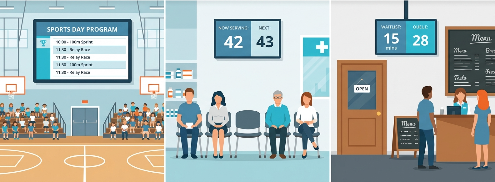

# live-board

「いま何番／何が進行中か」を全端末リアルタイム同期で大画面表示するアプリ。

会場の大型スクリーン・受付モニタ・来場者のスマホが、全員同じ画面を見られる。

公開URL: **https://tsubasagit.github.io/live-board/**

## 使える場面



- 🏃 運動会・体育祭・文化祭（保護者・別教室にスマホで進行共有）
- 💊 薬局の処方待ち（「ただいま◯番」を待合とスマホに同時表示）
- 🍜 飲食店・カフェの順番待ち（QRで「あと何組」が見える）
- 💇 美容室・歯科クリニックの呼び出し
- 💍 結婚式・パーティの進行表（司会・親族・ゲスト共有）
- 🏘 町内会・PTA・お祭りのステージ進行
- 🎤 セミナー・社内総会のアジェンダ進捗

## スクリーンショット

### 表示画面（来場者向け・大画面）
タイトル/場所/概要をヘッダーに、現在進行中のプログラムを中央に大きく表示。右側にプログラム一覧（現在地ハイライト・完了は打消し線）。運営者が「次へ」を押した瞬間、全端末で同時に切り替わる。


### 操作画面（運営者向け）
上段の「表示画面のレイアウト」で大画面側の見せ方をリアルタイム制御（イベント情報・プログラム一覧の表示/非表示）。下にイベント設定、進行コントロール（前へ/次へ）、プログラム一覧、CSV一括登録、危険な操作（イベント削除）まで1画面に集約。


## Tech Stack

- React + Vite + TypeScript
- Tailwind CSS
- Zustand
- Firebase Firestore
- GitHub Pages

## 構成

| 画面 | パス | 対象 |
|---|---|---|
| ホーム | `/` | 全員（QR・リンク表示） |
| 操作画面 | `/#/control` | 運営者（PIN認証） |
| 表示画面 | `/#/display` | 視聴者（フルスクリーン） |

## 開発

```bash
npm install
npm run dev    # http://localhost:5173
npm run build  # 本番ビルド
```

## ドキュメント

- 仕様: [SERVICE_SPEC.md](./SERVICE_SPEC.md)
- 技術メモ: [CLAUDE.md](./CLAUDE.md)
- Firebase セットアップ: [docs/FIREBASE_SETUP.md](./docs/FIREBASE_SETUP.md)

## License

MIT
